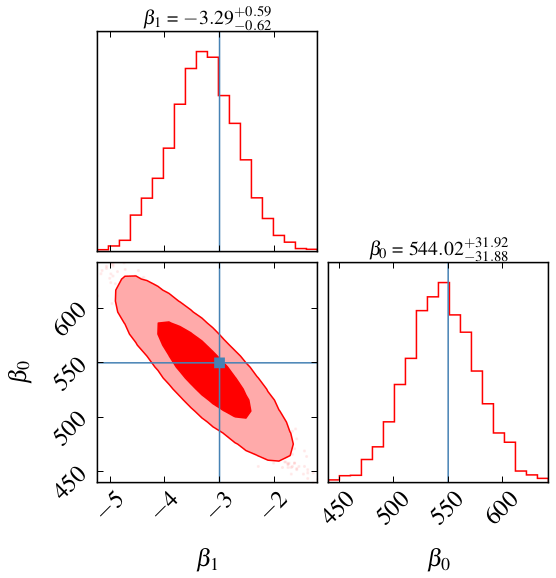

# Regression in Bayesian Statistics with PyJags



My study of a linear regression problem taken from Cap 10 of "Introduction to Bayesian Statistics", from Brendon J. Brewer.
The pdf is available in https://www.stat.auckland.ac.nz/~brewer/stats331.pdf

Note that I created a new pyplot style: souza.mplstyle
```
plt.style.use('souza')
```


To install pyjags:
```
sudo apt install jags
pip3 install pyjags
```
